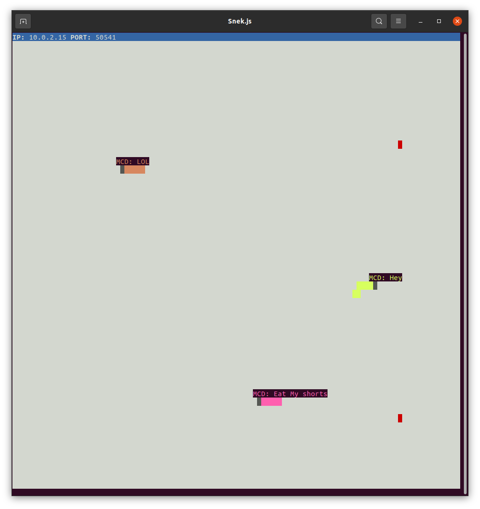

# Snake Client Project

Snake game is a very popular video game. It is a video game concept where the player maneuvers a dot and grows it by ‘eating’ pieces of food. As it moves and eats, it grows and the growing snake becomes an obstacle to smooth maneuvers. The goal is to grow it to become as big as possible without bumping into the side walls, or bumping into itself, upon which it dies.

This is simply a multiplayer take on the genre.

Before you can run this client, you will need to be running the server side which you can download and install from here. 

## Final Product

## Getting Started

- Follow steps inside the [snek server repo](https://github.com/lighthouse-labs/snek-multiplayer) to run the server side
- Run the development snake client using the `node play.js` command.

## NOTE 
- Inside the server folder I have only included the file I modified from the original [snek server repo](https://github.com/lighthouse-labs/snek-multiplayer) provided through my study at [Lighthouse Labs](https://github.com/lighthouse-labs)

## Features:
- [x] A message is sent to each currently connected player that announces the arrival of a new player as well as current player count.

## Future ToDo's
- [ ] Add a function that will display a current users ip address  
- [ ] Add a function that keeps the names of all users in a dynamic list and displays this on each users terminal 
- [ ] Add the ability to keep track of score and time  
- [ ] Allow the client to rejoin the game if there is space available  

**To be continued when new features are needed**